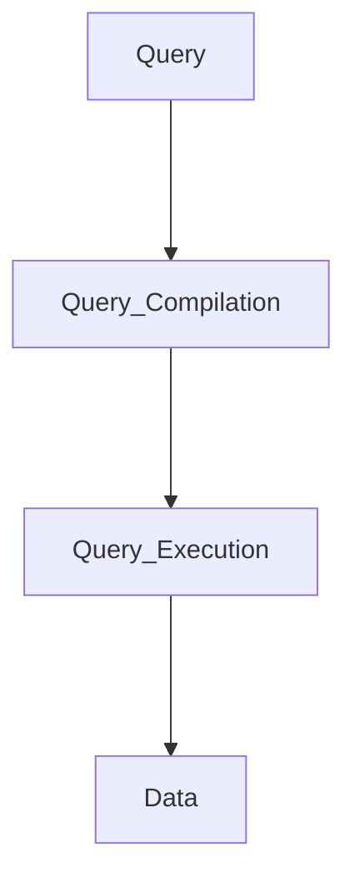

# Query Processor

1. Turns **user queries** and **data modification commands** into a sequence of **database operations**  and **executes** those operations
2. It determines the execution startegy

# Query Compilation 

1. **Parsing** - A parse tree for the query is constructed 
2. **Query Rewrite** - Orginal Parse tree is converted to a query plan , which is an algebraic representation of the query
3. **Physical Plan Generation** 
	- The abstract query plan is then turned into  physical query planby selecting algorithms to implement wach of the operators of the logical plan
	- Selects the order of execution for those operators

### Example
1. Basic Query
```sql
Select Name, Salary from Employee where ID = 123;
```
2. Logical Query Plan
```text
π NAME, SALARY (σ ID = 123 (EMPLOYEE))
```
3. Physical Query Plan
```text
Operators : Selection, Projection
```


